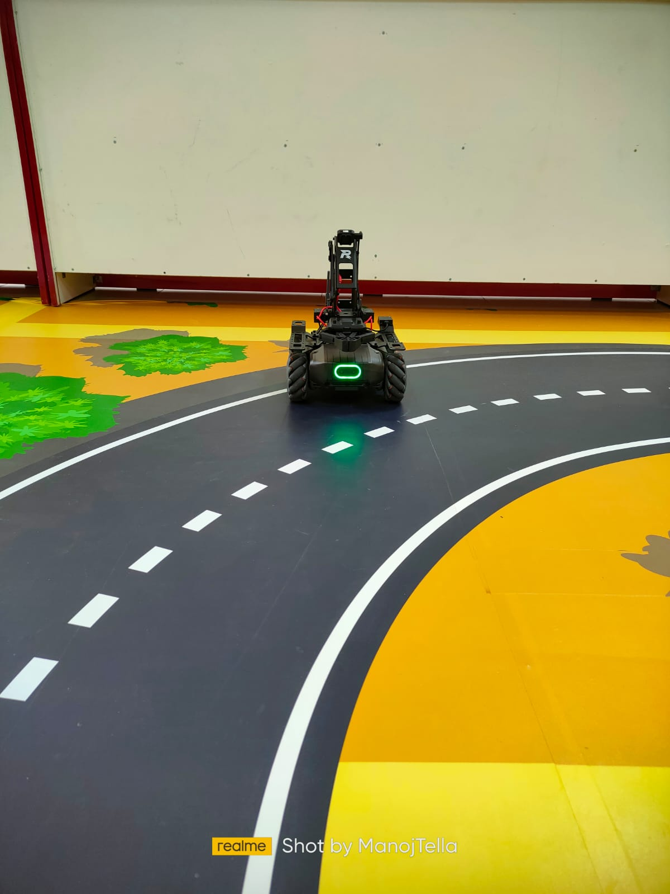
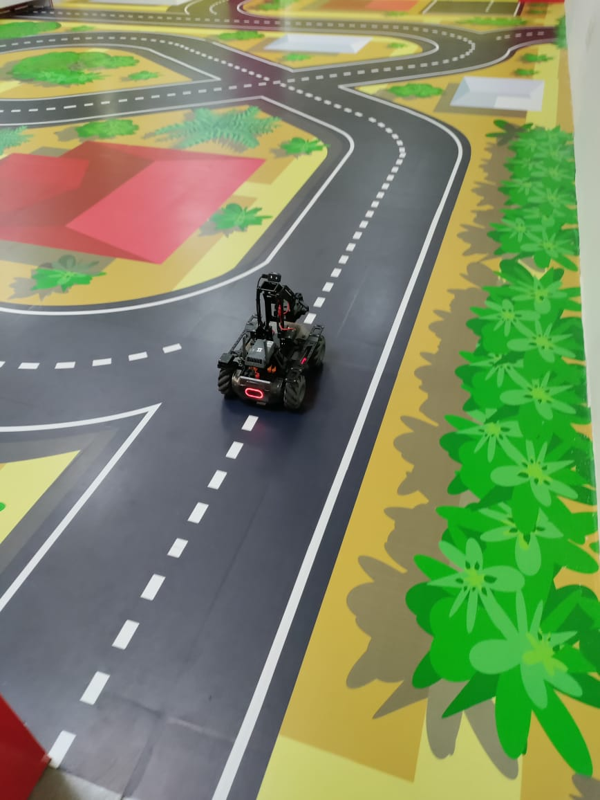

# MobileRobot-Openloopcontrol
## Aim:

To develop a python control code to move the mobilerobot along the predefined path.

## Equipments Required:
1. RoboMaster EP core
2. Python 3.7

## Procedure

Step1:
Start

Step2:
From robomaster import robot

Step3:
Initialize the type

Step4:
Run the program to move the robo moster through our condition

Step5:
Close

## Program
```
## NAME :P.Siva Naga Nithin.
## ref : 21003942
from robomaster import robot
import time

if __name__ == '__main__':
    ep_robot = robot.Robot()
    ep_robot.initialize(conn_type="ap")

    ep_chassis = ep_robot.chassis


    '''
    x = x-axis movement distance,( meters) [-5,5]
    y = y-axis movement distance,( meters) [-5,5]
    z = rotation about z axis ( degree)[-180,180]
    xy_speed = xy axis movement speed,( unit meter/second) [0.5,2]
    '''
    ep_chassis.move(x=2.2, y=0, z=0, xy_speed=0.75).wait_for_completed()

    ep_chassis.move(x=0, y=0, z=-85, xy_speed=1).wait_for_completed()

    ep_chassis.move(x=1.5, y=0, z=0, xy_speed=0.75).wait_for_completed()

    ep_chassis.move(x=0, y=0, z=-45, xy_speed=0.75).wait_for_completed()

    ep_chassis.move(x=3, y=0, z=10, xy_speed=0.75).wait_for_completed()

    ep_chassis.move(x=1, y=0, z=8, xy_speed=0.75).wait_for_completed()

    ep_robot.close()
```

## MobileRobot Movement Image:




## MobileRobot Movement Video:
https://youtu.be/0LmEiDSd3QE

## Result:
Thus the python program code is developed to move the mobilerobot in the predefined path.


<br/>
<br/>

```
Mobile Robotics Laboratory
Department of Artificial Intelligence and Data Science/ Machine Learning
Saveetha Engineering College
```
